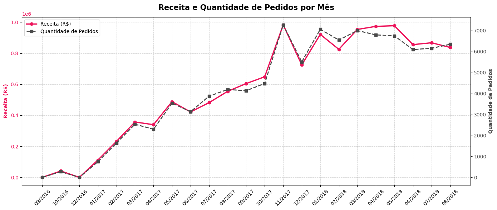
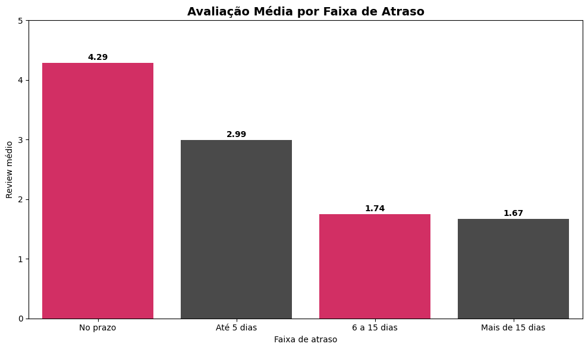
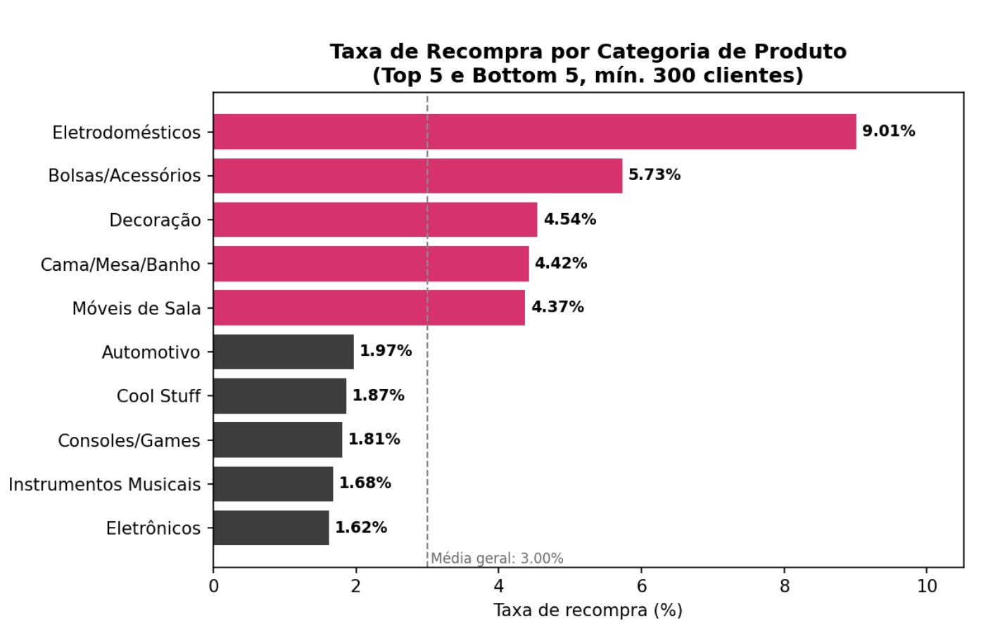
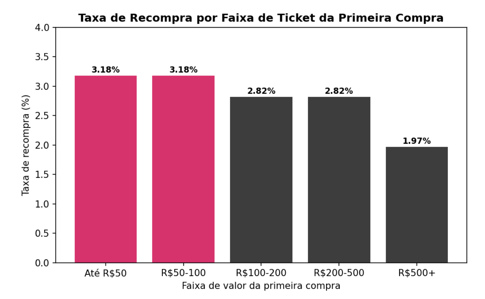

# Tech Challenge — Olist

Análise da relação entre logística, satisfação do cliente, retenção e crescimento, utilizando o Brazilian E-Commerce Public Dataset disponibilizado pela Olist.

---

## Objetivo

Investigar como o desempenho logístico influencia a satisfação dos clientes e o potencial de retenção e crescimento das operações de comércio eletrônico.

## Pergunta Norteadora

> O desempenho logístico impacta diretamente a satisfação dos clientes e o potencial de retenção e crescimento das operações de comércio eletrônico?

## Dataset

[Brazilian E-Commerce Public Dataset by Olist](https://www.kaggle.com/datasets/olistbr/brazilian-ecommerce) — aproximadamente 100 mil pedidos entre 2016 e 2018, cobrindo múltiplos marketplaces no Brasil, com tabelas relacionais de clientes, pedidos, itens, produtos, vendedores, pagamentos e avaliações.

## Principais Indicadores

- Receita e ticket médio
- Quantidade de pedidos
- Tempo médio de aprovação e de entrega
- Taxa de entregas no prazo (compliance de SLA)
- Avaliação média dos clientes (review score)
- Taxa de recompra e retenção de clientes
- Receita e volume de pedidos por estado

## Principais Resultados

| Achado | Evidência |
|---|---|
| Atrasos impactam negativamente a satisfação | Nota média cai de *4,29* (entrega no prazo) para *1,67* (mais de 15 dias de atraso) |
| Entregas mais rápidas geram avaliações superiores | Nota média de *4,43* (até 5 dias) a *3,12* (mais de 20 dias) |
| O crescimento da receita veio da aquisição, não da recorrência | Receita e volume de pedidos crescem juntos mês a mês; *97%* das compras são de clientes únicos |
| A taxa de recompra geral é baixa | Apenas *3%* dos clientes realizaram uma segunda compra no período analisado |
| Categoria de produto explica recompra melhor que atraso de entrega | Eletrodomésticos recompram *9,0%, frente a **1,6%* em eletrônicos — uma diferença estatisticamente significativa (p < 0,001), enquanto a diferença de recompra entre faixas de atraso não se mostrou significativa (p = 0,17) |
| A logística é fator estratégico para satisfação e reputação | A relação entre prazo de entrega e nota de avaliação é consistente em toda a base, reforçando o peso da logística na experiência do cliente |

> O quinto achado é um resultado de validação estatística: a hipótese inicial de que a logística explicaria diretamente a baixa recompra não se confirmou ao testar a correlação direta entre as duas variáveis. A logística permanece um fator relevante para a satisfação do cliente, mas a recompra parece estar mais associada ao tipo de produto e ao valor da compra do que ao desempenho de entrega.

## Visualizações

  
  

  
  

Todos os gráficos completos estão disponíveis em [images/](images/) e foram gerados a partir dos notebooks em [notebooks/](notebooks/).

## Estrutura do Projeto

.
├── notebooks/    # Notebooks Jupyter com a análise exploratória e os testes estatísticos
├── images/       # Gráficos exportados utilizados na análise e no relatório executivo
├── docs/         # Relatório executivo e documentação complementar
└── README.md

## Como Reproduzir

1. Clone o repositório:
   bash
   git clone https://github.com/Gscalambrini/olist-logistics-customer-retention-analysis.git
   cd olist-logistics-customer-retention-analysis
   
2. Instale as dependências:
   bash
   pip install pandas numpy matplotlib seaborn jupyter scipy
   
3. Baixe o dataset do [Kaggle](https://www.kaggle.com/datasets/olistbr/brazilian-ecommerce) e posicione os arquivos .csv na pasta esperada pelos notebooks (ver instruções no início de cada notebook em [notebooks/](notebooks/)).
4. Execute os notebooks em ordem a partir de notebooks/:
   bash
   jupyter notebook
   

## Ferramentas Utilizadas

- Python
- Pandas
- NumPy
- Matplotlib
- Seaborn
- SciPy (testes de significância estatística)
- Jupyter Notebook

## Relatório Executivo

A análise completa, incluindo recomendações estratégicas para retenção e crescimento, está documentada em [docs/](docs/).

## Autor

*Gustavo Scalambrini*

- GitHub: [@Gscalambrini](https://github.com/Gscalambrini)
- LinkedIn: [gustavo-scalambrini](http://www.linkedin.com/in/gustavo-scalambrini)
